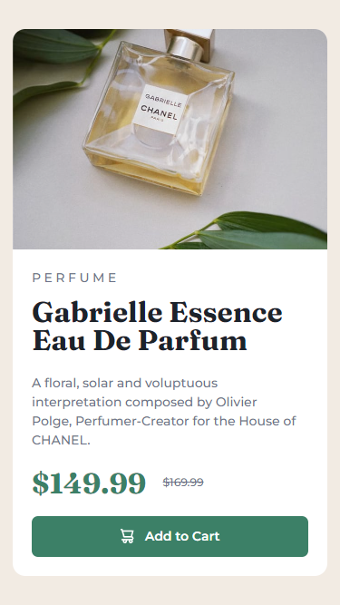

# Frontend Mentor - Product preview card component solution

This is a solution to the [Product preview card component challenge on Frontend Mentor](https://www.frontendmentor.io/challenges/product-preview-card-component-GO7UmttRfa). Frontend Mentor challenges help you improve your coding skills by building realistic projects. 

## Table of contents

- [Overview](#overview)
  - [The challenge](#the-challenge)
  - [Screenshots](#screenshots)
  - [Links](#links)
- [My process](#my-process)
  - [Built with](#built-with)
  - [What I learned](#what-i-learned)
  - [Useful resources](#useful-resources)
- [Author](#author)

## Overview

### The challenge

Users should be able to:

- View the optimal layout depending on their device's screen size
- See hover and focus states for interactive elements

### Screenshots

|  |  |
|--------------------------------|-------------------------------|
| Desktop version                | Mobile version                |

### Links

- Solution URL: [https://www.frontendmentor.io/solutions/product-preview-card-component-rkb6Ic4Z1G](https://www.frontendmentor.io/solutions/product-preview-card-component-rkb6Ic4Z1G)
<!-- - [Vercel Deployment](https://product-preview-card-component-tyran0.vercel.app/) -->

## My process

### Built with

- Semantic HTML5 markup
- CSS Flexbox
- CSS Grid
- [SASS](https://sass-lang.com/) - CSS Preprocessor

### What I learned

First thing is I learned how to set up custom npm scripts.
And with a help of 'http-server' was able to serve this
project locally. For explanation check out links under
'Useful resoures'.

``` json
"scripts": {
    "sass:build": "sass --no-source-map -s compressed src/sass:dist/css",
    "sass:watch": "sass --no-source-map -w src/sass:dist/css",
    "preserve": "npm run sass:build",
    "serve": "http-server ./dist -a localhost",
    "dev": "npm run serve -- -p 5500 -c-1",
    "start": "npm run serve"
}
```

Previously I finished this project with the help of some
JavasScript, and I used that to to make images responsive
(i.e. so different pictures would load based on display
width). But now i figured out how to do this without any JS,
and decided to update my code.

``` html
<picture>
    <source media="(max-width: 672px)"
            srcset="./assets/image-product-mobile.jpg">
     
</picture>
```

### Useful resources

- [http-server](https://github.com/http-party/http-server) -> is a utility for serving static pages, would definitely use for future challenges.
- [How npm handles the "scripts" field](https://docs.npmjs.com/cli/v9/using-npm/scripts) -> help me found out that you can use pre scripts not only with build-in npm scripts, but also with custom ones.
- [The HTML picture element explained](https://www.youtube.com/watch?v=Rik3gHT24AM) -> I really like tutorials from Kevin Powell; again helped me out massively, 100% recommended.

## Author

- GitHub - [tyran0](https://github.com/tyran0)
- Frontend Mentor - [@tyran0](https://www.frontendmentor.io/profile/tyran0)
